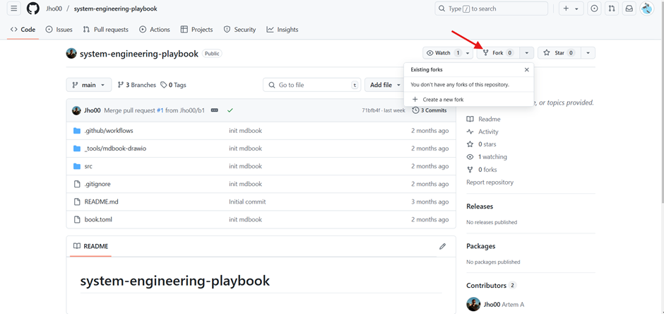
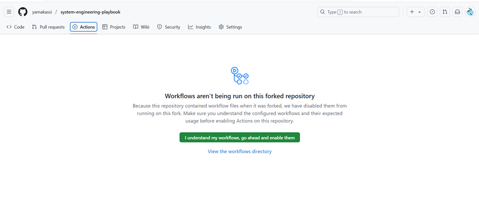
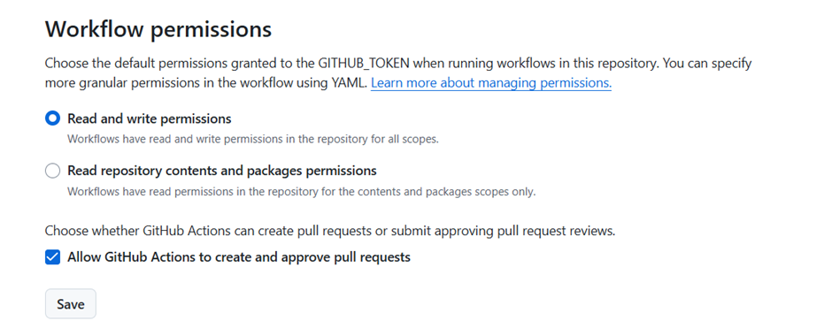
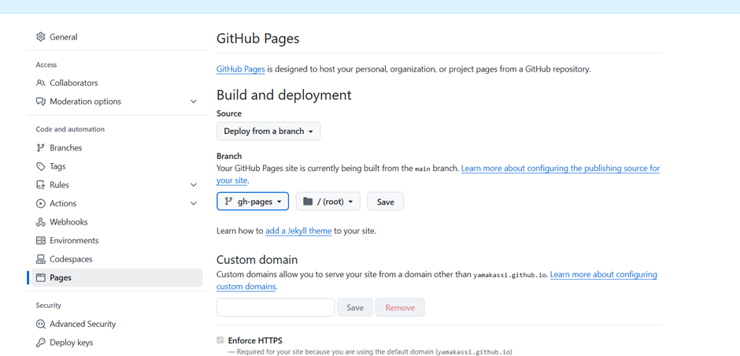
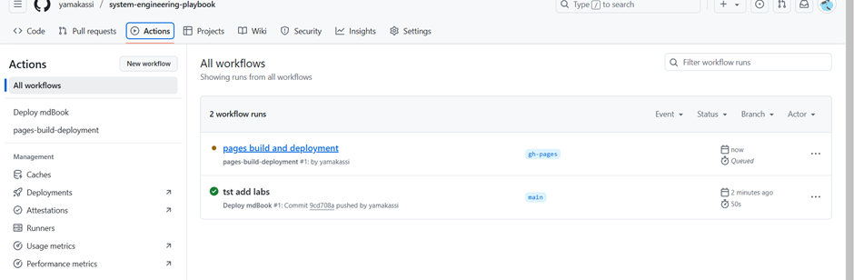
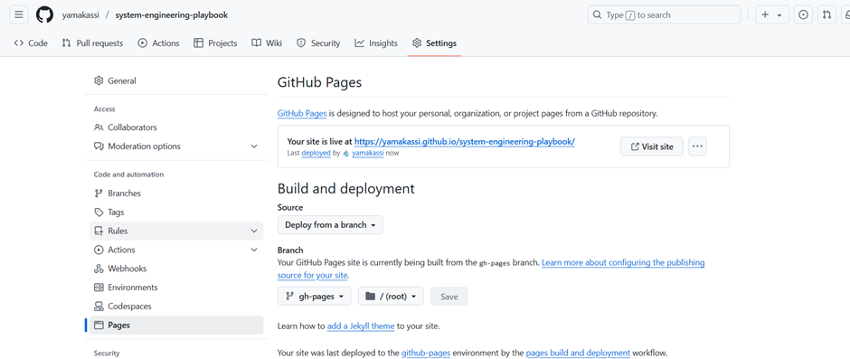

# system-engineering-playbook
# Инструкция для работы с репозиторием и mdbook
### 1. Создайте fork репозитория

### 2. После создания форка перейди во вкладку actions и включите workflows для своего репозитория

### 3. Проверьте что установлена настройка "Read and write permissions"
Перейдите в настройки своего github репозитория. Выберите вкладку Actions -> General. Установите "Read and write permissions" в категории Workflow permissions

### 4. Далее делаете любой коммит
Можете сделать сразу git clone проекта и добавить файл с лабой и после коммит

### 5. Далее откройте настройки и вкладку pages
- Установите source на 'deploy from a branch'
- Выберите ветку gh-pages (она создалась после первого коммита)

### 6. После этого запуститься сборка mdbook

### 7. Вернитесь в pages и там будет ссылка на размещенный mdbook
Она будет вида https://[github_user_name].github.io/system-engineering-playbook/

